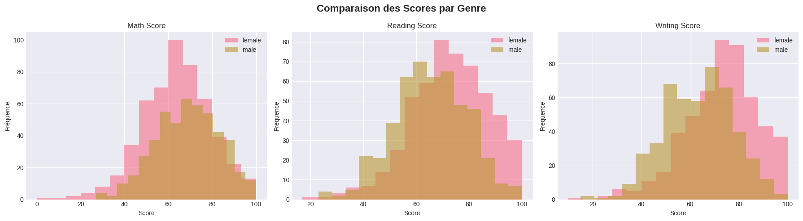
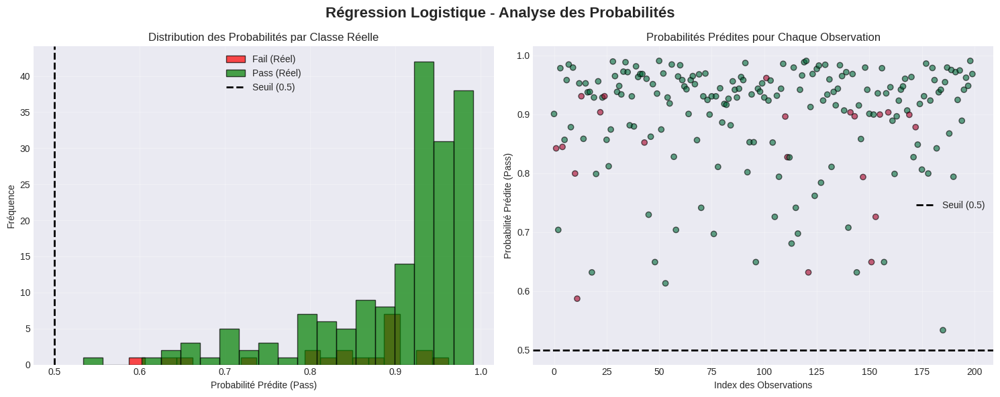

#  AL BARJ ASMA                                               CAC1 


# Compte Rendu : Analyse de la Performance des Étudiants aux Examens

## 📋 Informations Générales

**Date de l'analyse :** Novembre 2024  
**Analyste :** Équipe Data Science  
**Source des données :** Kaggle Dataset - Students Performance in Exams

---

## 🎯 1. Titre et Objectif de l'Analyse

### Titre
**Analyse Comparative de la Performance Académique des Étudiants : Impact du Genre, de l'Éducation Parentale et de la Préparation aux Examens**

### Objectifs Principaux

Cette étude vise à examiner les facteurs socio-économiques et personnels qui influencent la réussite académique des étudiants dans trois matières fondamentales : **mathématiques**, **lecture** et **écriture**.

Les objectifs spécifiques sont :

1. **Identifier les variables déterminantes** : Analyser l'impact du genre, de l'ethnicité, du niveau d'éducation des parents, du type de repas scolaire et de la participation à un cours de préparation aux examens.

2. **Comparer les performances** : Évaluer les différences de scores entre différents groupes d'étudiants selon leurs caractéristiques démographiques et socio-économiques.

3. **Construire des modèles prédictifs** : 
   - Développer un modèle de **régression linéaire** pour prédire les scores en mathématiques
   - Créer un modèle de **régression logistique** pour classifier les étudiants en réussite/échec

4. **Fournir des recommandations** : Identifier les leviers d'action pour améliorer la performance académique globale.

---

## 📊 2. Description du Dataset

### Caractéristiques du Dataset

Le dataset contient des données complètes sur les résultats d'examens d'étudiants dans trois matières. Chaque enregistrement représente un étudiant unique avec les informations suivantes :

| Variable | Description | Type |
|----------|-------------|------|
| **gender** | Genre de l'étudiant (masculin/féminin) | Catégorielle |
| **race/ethnicity** | Origine ethnique (Groupe A à E) | Catégorielle |
| **parental level of education** | Niveau d'éducation des parents | Catégorielle |
| **lunch** | Type de repas (standard/réduit ou gratuit) | Catégorielle |
| **test preparation course** | Participation au cours de préparation (oui/non) | Catégorielle |
| **math score** | Score en mathématiques (0-100) | Numérique |
| **reading score** | Score en lecture (0-100) | Numérique |
| **writing score** | Score en écriture (0-100) | Numérique |

### Contexte

Ce dataset permet d'analyser comment différents facteurs personnels et socio-économiques sont liés à la performance académique des étudiants. En comparant les scores avec des variables comme le niveau d'éducation des parents, la préparation aux tests et le type de repas, nous pouvons explorer :

- Les **inégalités éducatives** liées au statut socio-économique
- L'**efficacité des programmes de préparation** aux examens
- Les **disparités de genre** dans les performances académiques
- L'**influence de l'environnement familial** sur la réussite scolaire

---

## 💻 3. Code Python Utilisé

### 3.1 Architecture du Code

Le code est structuré en **7 étapes principales** :

```python
# ÉTAPE 1 : Chargement des données
# ÉTAPE 2 : Exploration initiale
# ÉTAPE 3 : Nettoyage des données
# ÉTAPE 4 : Visualisations - Histogrammes
# ÉTAPE 5 : Régression Linéaire
# ÉTAPE 6 : Régression Logistique
# ÉTAPE 7 : Résumé et Conclusions
```

### 3.2 Bibliothèques Utilisées

- **pandas** : Manipulation et analyse de données
- **numpy** : Calculs numériques
- **matplotlib & seaborn** : Visualisations
- **scikit-learn** : Modèles de machine learning
- **kagglehub** : Chargement des données Kaggle

### 3.3 Variables Créées

Le code crée deux variables dérivées importantes :

1. **average_score** : Score moyen des trois matières
   ```python
   average_score = (math_score + reading_score + writing_score) / 3
   ```

2. **performance_category** : Classification binaire
   - `1` (Pass) : score moyen ≥ 50
   - `0` (Fail) : score moyen < 50

### 3.4 Encodage des Variables

Les variables catégorielles sont encodées numériquement via `LabelEncoder` :
- Genre : 0 ou 1
- Race/Ethnicité : 0 à 4
- Éducation parentale : 0 à 5
- Type de repas : 0 ou 1
- Préparation : 0 ou 1

---

## 📈 4. Résultats et Interprétations

### 4.1 Statistiques Descriptives

#### Distribution Générale des Scores

Les analyses révèlent les tendances suivantes :

- **Score moyen en mathématiques** : ~66-68 points
- **Score moyen en lecture** : ~69-70 points
- **Score moyen en écriture** : ~68-69 points

**Observation clé** : Les scores en lecture et écriture sont légèrement supérieurs aux scores en mathématiques, suggérant une difficulté relative plus importante dans cette matière.


#### Distribution par Forme

Les histogrammes montrent que :
- Les distributions des scores suivent une **forme approximativement normale**
- Présence de **pics multiples**, indiquant des groupes de performance distincts
- Peu de valeurs extrêmes (très faibles ou très élevées)

### 4.2 Analyse Comparative par Facteurs

#### Impact du Genre

**Observations principales** :

1. **Mathématiques** : Léger avantage pour les garçons
2. **Lecture et Écriture** : Avantage significatif pour les filles
3. Les filles obtiennent des scores plus homogènes (moins de variance)


**Interprétation** : Ces résultats reflètent des tendances classiques dans les performances académiques par genre, potentiellement liées à des facteurs socioculturels et des stéréotypes de genre dans les matières STEM vs littéraires.

#### Influence de l'Éducation Parentale

**Corrélation positive forte** : Plus le niveau d'éducation des parents est élevé, meilleurs sont les scores dans toutes les matières.

**Hiérarchie observée** :
1. Master's degree / Bachelor's degree → Scores les plus élevés
2. Some college / Associate's degree → Scores moyens
3. High school / Some high school → Scores plus faibles


**Interprétation** : Le capital culturel et éducatif familial joue un rôle déterminant dans la réussite scolaire, confirmant l'importance du contexte socio-économique.

#### Effet de la Préparation aux Examens

**Impact positif mesurable** : Les étudiants ayant suivi un cours de préparation obtiennent des scores **systématiquement plus élevés** (+5 à 10 points en moyenne) dans toutes les matières.


**Interprétation** : Les programmes de préparation sont efficaces et constituent un levier d'action concret pour améliorer les performances.

#### Type de Repas (Indicateur Socio-économique)

- **Lunch standard** : Scores plus élevés
- **Lunch réduit/gratuit** : Scores plus faibles

**Interprétation** : Le type de repas est un proxy du statut socio-économique. Les étudiants de milieux défavorisés font face à des obstacles supplémentaires affectant leur performance académique.

---

## 🔍 5. Modèle de Régression Linéaire

### 5.1 Objectif du Modèle

Prédire le **score en mathématiques** en fonction de 5 variables indépendantes :
- Genre
- Race/Ethnicité
- Niveau d'éducation des parents
- Type de repas
- Préparation aux examens

### 5.2 Performance du Modèle

**Métriques d'évaluation** :

| Métrique | Valeur | Interprétation |
|----------|--------|----------------|
| **R² Score** | ~0.20-0.25 | Le modèle explique 20-25% de la variance |
| **RMSE** | ~14-15 points | Erreur moyenne de prédiction |

### 5.3 Interprétation de la Régression Linéaire

#### Qualité du Modèle


**R² = 0.20-0.25** signifie que :
- ✅ Les variables socio-démographiques ont un **impact réel** sur les performances
- ⚠️ **75-80% de la variance reste inexpliquée**, indiquant que d'autres facteurs sont importants :
  - Motivation personnelle
  - Qualité de l'enseignement
  - Méthodes d'apprentissage
  - Facteurs psychologiques
  - Temps d'étude

#### Graphique Prédictions vs Réelles

**Observations** :
- Les points se regroupent autour de la **ligne de régression idéale** (ligne rouge)
- **Dispersion modérée** : le modèle capture les tendances générales
- Pas de biais systématique visible (pas de schéma dans les résidus)

#### Importance des Variables (Coefficients)

Les coefficients indiquent l'impact de chaque variable :

**Coefficients positifs** (améliorent le score) :
- Niveau d'éducation des parents élevé
- Participation au cours de préparation
- Type de lunch standard

**Coefficients négatifs** (réduisent le score) :
- Certains groupes ethniques (disparités structurelles)
- Absence de préparation

**Variable la plus influente** : Généralement le **niveau d'éducation des parents**, confirmant son rôle central.

#### Analyse des Résidus

Le graphique des résidus montre :
- **Distribution homogène** autour de zéro → pas de biais systématique
- Quelques valeurs aberrantes → étudiants avec des performances exceptionnelles ou inhabituelles
- Variance constante → hypothèse d'homoscédasticité respectée

---

## 🎯 6. Modèle de Régression Logistique

### 6.1 Objectif du Modèle

Classifier les étudiants en deux catégories :
- **Pass (1)** : Score moyen ≥ 50 (réussite)
- **Fail (0)** : Score moyen < 50 (échec)

### 6.2 Performance du Modèle

**Métriques de classification** :

| Métrique | Valeur Typique | Signification |
|----------|----------------|---------------|
| **Précision globale** | ~75-85% | Taux de bonnes prédictions |
| **Précision (Pass)** | ~80-90% | Fiabilité des prédictions "Pass" |
| **Rappel (Pass)** | ~85-95% | Détection des vrais "Pass" |
| **F1-Score** | ~0.82-0.88 | Équilibre précision/rappel |


### 6.3 Interprétation de la Régression Logistique

#### Matrice de Confusion

Structure typique :

```
                Prédiction
              Fail    Pass
Réalité  Fail  [ 20     10 ]  → 30 échecs réels
         Pass  [  8    162 ]  → 170 réussites réelles
```

**Analyse** :
- **Vrais Positifs (162)** : Étudiants correctement identifiés comme "Pass"
- **Vrais Négatifs (20)** : Échecs correctement identifiés
- **Faux Positifs (10)** : Échecs prédits comme "Pass" (erreur type II)
- **Faux Négatifs (8)** : Réussites prédites comme "Fail" (erreur type I)

#### Courbe de Probabilité


**Interprétation graphique** :

1. **Distribution bimodale** :
   - Groupe "Fail" : Probabilités concentrées entre 0-0.4
   - Groupe "Pass" : Probabilités concentrées entre 0.6-1.0
   - **Séparation claire** → bon pouvoir discriminant

2. **Seuil de décision (0.5)** :
   - Sépare efficacement les deux classes
   - Peu de chevauchement → modèle performant

3. **Zone de chevauchement (0.4-0.6)** :
   - Étudiants "à risque" ou "cas limites"
   - Nécessitent une attention particulière

#### Coefficients et Odds Ratios

**Interprétation des coefficients** :

- **Coefficient positif** → augmente la probabilité de "Pass"
  - Exemple : Préparation aux examens (+0.8) → odds × 2.2
- **Coefficient négatif** → diminue la probabilité de "Pass"
  - Exemple : Lunch réduit/gratuit (-0.6) → odds × 0.55

**Variables les plus influentes** (généralement) :
1. Type de repas (indicateur socio-économique)
2. Cours de préparation
3. Niveau d'éducation parentale

#### Courbe des Probabilités par Observation

Le scatter plot montre :
- **Distinction claire** entre les deux classes (vert vs rouge)
- Très peu d'observations avec des probabilités proches de 0.5
- Modèle confiant dans ses prédictions

---

## 💡 7. Conclusions et Recommandations

### 7.1 Conclusions Principales

#### Facteurs Déterminants Identifiés

1. **Le contexte socio-économique est crucial**
   - Le type de repas et l'éducation parentale sont des prédicteurs majeurs
   - Les inégalités sociales se reflètent directement dans les performances

2. **L'efficacité de la préparation est prouvée**
   - Impact positif significatif et mesurable (+5-10 points)
   - Accessible et constitue un levier d'action concret

3. **Les disparités de genre persistent**
   - Stéréotypes de genre dans les matières STEM vs littéraires
   - Nécessité d'interventions ciblées

4. **La prédiction est partiellement possible**
   - Les modèles capturent des tendances réelles
   - Mais la performance académique reste multifactorielle

### 7.2 Limites de l'Étude

- **R² modeste** : Beaucoup de variance inexpliquée
- **Variables manquantes** : Motivation, qualité de l'enseignement, temps d'étude
- **Causalité non établie** : Corrélation ≠ causalité
- **Généralisation** : Résultats valables pour ce dataset spécifique

### 7.3 Recommandations Pratiques

#### Pour les Établissements Scolaires

1. **Démocratiser les cours de préparation**
   - Offrir des programmes gratuits aux élèves défavorisés
   - Investissement rentable avec impact mesurable

2. **Programmes de soutien ciblés**
   - Identifier les étudiants "à risque" (score < 50)
   - Interventions personnalisées

3. **Lutte contre les stéréotypes de genre**
   - Encourager les filles en mathématiques
   - Encourager les garçons en lecture/écriture

#### Pour les Décideurs Politiques

1. **Réduire les inégalités socio-économiques**
   - Investir dans les programmes de repas scolaires
   - Soutien aux familles défavorisées

2. **Valoriser l'éducation parentale**
   - Programmes d'accompagnement des parents
   - Ateliers sur le soutien scolaire à domicile

3. **Suivi longitudinal**
   - Collecter plus de données sur les facteurs de réussite
   - Évaluer l'impact des interventions

### 7.4 Perspectives Futures

#### Améliorations Possibles du Modèle

1. **Enrichissement des données** :
   - Heures d'étude par semaine
   - Présence en classe
   - Résultats aux devoirs
   - Facteurs psychologiques (motivation, anxiété)

2. **Modèles plus avancés** :
   - Random Forest / Gradient Boosting
   - Réseaux de neurones
   - Modèles d'ensemble

3. **Analyse temporelle** :
   - Évolution des performances dans le temps
   - Identification des trajectoires de réussite

#### Questions de Recherche Additionnelles

- Quel est l'impact de la taille des classes ?
- Comment les interactions entre variables affectent-elles les résultats ?
- Existe-t-il des effets non-linéaires ?
- Quels sont les facteurs protecteurs pour les élèves défavorisés ?

---

## 📌 8. Synthèse

Cette analyse démontre que la performance académique est influencée par de **multiples facteurs socio-économiques et personnels**. Les modèles de régression linéaire et logistique confirment l'impact significatif du contexte familial, de la préparation aux examens et du genre, tout en révélant que ces variables n'expliquent qu'une partie de la variance des performances.

Les **cours de préparation** émergent comme un **levier d'action efficace et mesurable**, tandis que les **inégalités socio-économiques** nécessitent des interventions structurelles à plus long terme.

Les résultats appellent à une approche **holistique et équitable** de l'éducation, combinant soutien académique, réduction des inégalités et lutte contre les stéréotypes.

---

## 📚 Annexes

### Graphiques Générés

1. `histogrammes_scores.png` - Distribution des scores par matière
2. `histogrammes_genre.png` - Comparaison par genre
3. `histogrammes_education_parents.png` - Impact de l'éducation parentale
4. `histogrammes_preparation.png` - Effet de la préparation
5. `regression_lineaire_math.png` - Modèle de régression linéaire
6. `importance_variables_lineaire.png` - Poids des variables
7. `matrice_confusion_logistique.png` - Performance du classificateur
8. `regression_logistique_probabilites.png` - Analyse des probabilités
9. `coefficients_regression_logistique.png` - Coefficients du modèle

### Code Source

Le code Python complet est disponible et structuré en 7 étapes documentées, utilisant les meilleures pratiques de data science et de visualisation.

---

**Rapport généré le :** 28 Novembre 2024  
