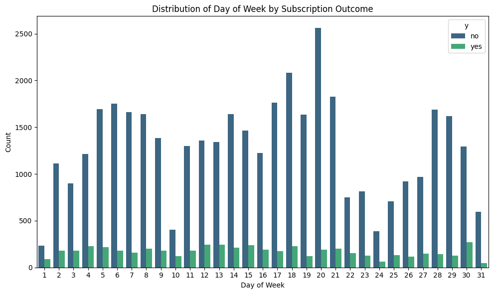
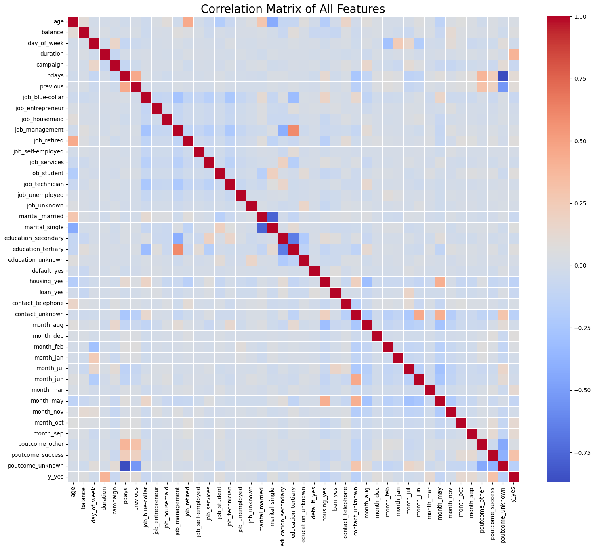

# AL BARJ ASMA 
# étudiante en 4ᵉ année à l’ENCG Settat, spécialité Contrôle, Audit et Finance (CAC).


# 🏦 Analyse et Contexte du Jeu de Données : Bank Marketing


## 📘 Contexte général

Le jeu de données **Bank Marketing** provient d’une **institution bancaire portugaise** ayant mené plusieurs **campagnes de marketing direct** entre **mai 2008 et novembre 2010**.  
Ces campagnes avaient pour but de promouvoir un **produit financier spécifique : le dépôt à terme (term deposit)**, un placement bancaire rémunéré sur une période donnée.

Les chercheurs **Sérgio Moro**, **Paulo Cortez** et **Paulo Rita** de l’Université du Minho (Portugal) ont collecté et analysé ces données dans le cadre d’une étude publiée en **2014**.  
Leur objectif était de **comprendre les facteurs influençant la décision des clients** à souscrire ou non à un dépôt à terme, et d’optimiser les stratégies de marketing bancaire.  

Le jeu de données a ensuite été rendu public via le **UCI Machine Learning Repository**, une base de référence internationale pour les chercheurs en **data science** et **apprentissage automatique**.

---

## 🎯 Objectif du jeu de données

L’objectif principal de cette base est **prédictif** :  
> Déterminer, à partir des caractéristiques d’un client et des informations issues de la campagne, **s’il souscrira (“yes”) ou non (“no”)** à un dépôt à terme.

Il s’agit d’une **tâche de classification supervisée**, très utilisée dans le domaine du machine learning, où l’on cherche à prédire une variable catégorielle à partir de plusieurs variables explicatives.

---

## 🧩 Description générale

| Élément | Description |
|----------|-------------|
| **Type de données** | Multivariées |
| **Nombre d’observations** | 45 211 individus |
| **Nombre de variables (features)** | 16 à 20 selon la version |
| **Types de variables** | Catégorielles et entières |
| **Variable cible** | `y` → souscription à un dépôt à terme (“yes” / “no”) |

Les variables incluent :
- **Caractéristiques socio-démographiques** : âge, profession, situation familiale, niveau d’éducation  
- **Informations financières** : solde du compte, crédits en cours, emprunts  
- **Données de la campagne** : durée de l’appel, mois, jour, nombre de contacts  
- **Facteurs macroéconomiques** : taux d’emploi, inflation, indicateurs de confiance

---

## 🧠 Méthodologie de collecte

Les données ont été **recueillies via des appels téléphoniques** réalisés par des agents commerciaux de la banque.  
Souvent, **plusieurs appels ont été nécessaires** pour obtenir une réponse finale du client.  
Chaque observation du jeu de données correspond donc à **une interaction entre un agent et un client**, accompagnée du résultat de la démarche commerciale (abonnement ou non au produit).

Quatre versions du jeu de données sont disponibles :
1. **bank-additional-full.csv** : 41 188 observations, 20 variables, triées chronologiquement (2008–2010)  
2. **bank-additional.csv** : échantillon aléatoire de 10 % du précédent (4 119 observations)  
3. **bank-full.csv** : version antérieure avec 17 variables  
4. **bank.csv** : 10 % de l’échantillon précédent, pour les tests d’algorithmes exigeants (SVM, etc.)

---

## 🌍 Contexte économique

Cette étude s’inscrit dans la période **post-crise financière de 2008**, un moment où les banques européennes cherchaient à :
- **renforcer leur liquidité** en attirant de nouveaux dépôts,  
- et **améliorer l’efficacité** de leurs campagnes de marketing.

L’analyse visait à **identifier les profils de clients les plus susceptibles de souscrire** un dépôt à terme, afin de :
- **réduire les coûts de prospection**,  
- **améliorer les taux de conversion**,  
- et **cibler les bonnes personnes au bon moment**.

---

## ⚖️ Licence et réutilisation

Ce jeu de données est publié sous la licence **Creative Commons Attribution 4.0 International (CC BY 4.0)**.  
Cette licence autorise le **partage et l’adaptation** du jeu de données à toute fin, à condition de **mentionner correctement la source et les auteurs**.

**Référence à citer :**  
> Moro, S., Cortez, P., & Rita, P. (2014). *A Data-Driven Approach to Predict the Success of Bank Telemarketing*. Decision Support Systems, 62, 22–31.

---

## 🧾 Résumé synthétique

| Élément | Détail |
|----------|--------|
| **Nom du dataset** | Bank Marketing |
| **Origine** | Campagnes téléphoniques d’une banque portugaise |
| **Période couverte** | 2008 – 2010 |
| **Chercheurs** | Sérgio Moro, Paulo Cortez, Paulo Rita |
| **Objectif** | Prédire la souscription d’un dépôt à terme |
| **Type d’analyse** | Classification supervisée |
| **Méthode de collecte** | Appels téléphoniques |
| **Licence** | Creative Commons BY 4.0 |
| **Domaine d’application** | Marketing bancaire, Machine Learning |
## 🧾 CODE PYTHON 
```python
from ucimlrepo import fetch_ucirepo 
  
# fetch dataset 
bank_marketing = fetch_ucirepo(id=222) 
  
# data (as pandas dataframes) 
X = bank_marketing.data.features 
y = bank_marketing.data.targets 
  
# metadata 
print(bank_marketing.metadata) 
  
# variable information 
print(bank_marketing.variables) 
print("### First 5 rows of X DataFrame:\n")
print(X.head())
print("\n### First 5 rows of y DataFrame:\n")
print(y.head())

print("\n### Info for X DataFrame:\n")
X.info()
print("\n### Info for y DataFrame:\n")
y.info()

print("\n### Descriptive statistics for X DataFrame (numerical columns):\n")
print(X.describe())

print("\n### Missing values in X DataFrame:\n")
print(X.isnull().sum())

print("\n### Unique values for categorical columns in X DataFrame:\n")
for col in X.select_dtypes(include='object').columns:
    print(f"\nUnique values for column '{col}':\n{X[col].unique()}")

print("\n### Missing values in y DataFrame:\n")
print(y.isnull().sum())

print("\n### Unique values and their counts for y DataFrame:\n")
print(y['y'].value_counts())
for col in ['job', 'education', 'contact', 'poutcome']:
    X[col] = X[col].fillna('unknown')

# Combine X and y into a single DataFrame
df = pd.concat([X, y], axis=1)

print("### Missing values in X DataFrame after handling NaNs:")
print(X[['job', 'education', 'contact', 'poutcome']].isnull().sum())
print("\n### First 5 rows of combined DataFrame (df):")
print(df.head())
print("\n### Info for combined DataFrame (df):")
df.info()
import matplotlib.pyplot as plt
import seaborn as sns

# Identify categorical columns
categorical_cols = df.select_dtypes(include='object').columns

# Exclude the target variable 'y' from the categorical columns to plot as a feature
categorical_features = [col for col in categorical_cols if col != 'y']

# Plot bar charts for each categorical feature
for col in categorical_features:
    plt.figure(figsize=(10, 6))
    sns.countplot(data=df, x=col, hue='y', palette='viridis')
    plt.title(f'Distribution of {col} by Subscription Outcome')
    plt.xlabel(col)
    plt.ylabel('Count')
    plt.xticks(rotation=45, ha='right') # Rotate labels for better readability
    plt.tight_layout()
    plt.show()
import pandas as pd
import matplotlib.pyplot as plt
import seaborn as sns

# Convert categorical features to numerical using one-hot encoding
df_encoded = pd.get_dummies(df, drop_first=True)

# Calculate the correlation matrix
correlation_matrix = df_encoded.corr()

# Plotting the heatmap
plt.figure(figsize=(18, 15))
sns.heatmap(correlation_matrix, annot=False, cmap='coolwarm', fmt=".2f", linewidths=.5)
plt.title('Correlation Matrix of All Features', fontsize=20)
plt.show()
```


---
# GRAPHIQUES


#  MATRICE DE CORRELATION 

## 📚 Conclusion

Le jeu de données **Bank Marketing** constitue une ressource précieuse pour l’apprentissage et la recherche en **science des données appliquée au marketing**.  
Il permet d’expérimenter différentes méthodes de **classification**, de **prédiction comportementale** et d’**optimisation de campagnes commerciales**, tout en illustrant l’importance de la **donnée dans la prise de décision stratégique**.
